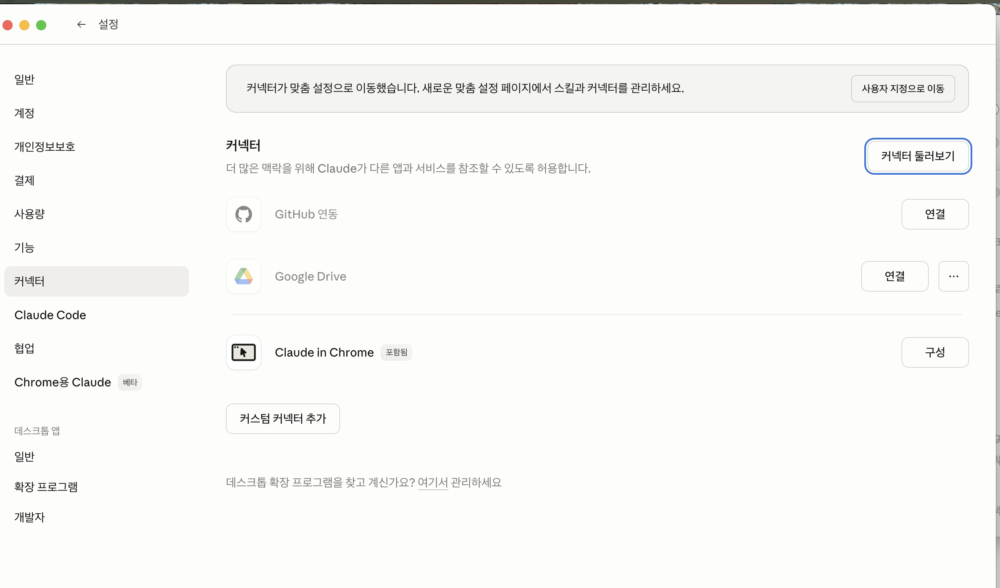
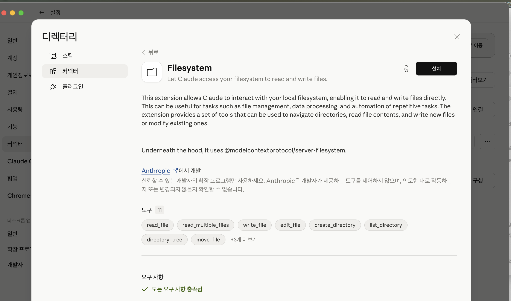
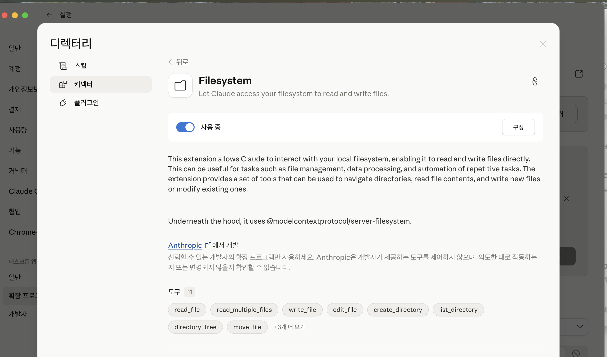

# Unity Claude Template — 솔리테어로 시작하기

**한국어** · [English](README.en.md)

> **코딩 해본 적 없어도 됩니다.** Claude Desktop 앱에서 말로만 시켜서, 이 템플릿으로 솔리테어를 완성해보는 튜토리얼입니다. 씬 조립·스크립트 작성·실행·빌드까지 Claude가 Unity Editor를 **직접** 조작합니다. 여러분은 확인만 하시면 됩니다.

---

## 0. 전체 흐름

1. **준비 20분** — Unity, Claude Desktop, 이 템플릿 받기
2. **MCP 두 개 연결 5분** — Claude가 내 파일과 Unity를 조작할 수 있게
3. **"솔리테어 만들어줘" 한 줄** — 나머지는 Claude가 물어가며 진행

---

## 1. 준비

| 필요한 것 | 받는 곳 |
|---|---|
| Unity Hub + Unity 2022.3 LTS | [unity.com/download](https://unity.com/download) |
| Claude Desktop 앱 | [claude.ai/download](https://claude.ai/download) |
| Python 3.10 이상 | macOS: `python3 --version`으로 기본 설치 확인 / Windows: [python.org](https://python.org) |
| 이 템플릿 | 오른쪽 위 **Use this template** → 본인 계정에 복사 → 초록 **Code** 버튼 → **Download ZIP** |

ZIP 풀어서 `~/Documents/my-solitaire` 같은 곳에 놓아주세요. **경로에 한글·공백 없게.**

---

## 2. Claude Desktop에 **두 개**의 MCP 연결

Claude가 여러분 컴퓨터를 조작하려면 MCP 두 개가 필요합니다:

- **Filesystem MCP** — 파일 읽고 쓰기
- **Claude Bridge MCP** — Unity Editor 조작

### 2-1. Filesystem MCP (30초)

**1)** Claude Desktop → **설정** → 사이드바 **커넥터** → 우측 상단 **커넥터 둘러보기**



**2)** 목록에서 **Filesystem** 선택 → **설치**



**3)** 토글이 **사용 중**으로 켜지면 **구성** 버튼 → 방금 압축 푼 템플릿 폴더 선택



### 2-2. Claude Bridge MCP (1분)

이 MCP는 이 템플릿에 **이미 포함**되어 있습니다. 설치만 하시면 됩니다.

**1)** 터미널 열고 MCP용 Python 패키지 설치:

```bash
pip3 install mcp
```

**2)** Claude Desktop 설정 파일을 엽니다:

- macOS: Finder에서 `Cmd+Shift+G` → `~/Library/Application Support/Claude/` 입력 → `claude_desktop_config.json` 을 텍스트 편집기로 열기
- Windows: `%APPDATA%\Claude\claude_desktop_config.json`

**3)** `mcpServers` 블록에 `claude-bridge` 항목을 추가합니다 (`filesystem` 바로 다음에):

```json
{
  "mcpServers": {
    "filesystem": { "...": "..." },
    "claude-bridge": {
      "command": "python3",
      "args": [
        "/Users/여러분이름/Documents/my-solitaire/scripts/claude-bridge-mcp/server.py"
      ]
    }
  }
}
```

**경로는 여러분 템플릿 위치**로 바꿔주세요.

**4)** Claude Desktop 완전 종료 (Cmd+Q) 후 재실행.

**5)** 새 채팅창에서 한 줄 테스트:

> `unity_bridge_status` 툴 불러서 상태 보여줘.

`project_root`가 여러분 템플릿 폴더로 잡히면 성공. `editor_running: false`면 정상 (아직 Unity 안 켰음).

---

## 3. 솔리테어 만들기 시작

이제부터는 **대화만** 합니다. 아래를 채팅창에 그대로 붙여넣으세요:

> 나 Unity 처음 써봐. 이 폴더가 unity-claude-template이야. 클론다이크 솔리테어를 만들고 싶어.
>
> 단계 잘게 쪼개서 진행해줘. 막히면 이미지나 정보 요청해도 돼.
>
> 프로그래밍은 모르니까 코드는 네가 알아서 써. 나는 Unity 창에서 결과만 확인할게.

Claude가 대략 이렇게 답할 겁니다:

1. `CLAUDE.md`, `RULES.md`, `.claude/INDEX.md` 먼저 읽기
2. 솔리테어 설계안 3~5단계로 제시
3. "1단계 시작할까요?" 확인

**"응"** 하면 Claude가 순서대로 진행합니다. 개입할 필요 없이 진행 중 물어보는 것만 답해주세요. 진행 중에 보게 되는 장면들:

### 3-1. 스크립트 작성

Claude가 `Assets/Scripts/_Core/`, `_UI/` 아래에 `Card.cs`, `Deck.cs`, `SolitaireGame.cs` 등을 만듭니다. 파일 생성 권한 요청이 뜨면 **Allow**.

### 3-2. 카드 프리팹 자동 제작 (`/make-asset`)

솔리테어는 카드 프리팹이 필요한데 템플릿엔 이미지만 있고 프리팹은 없습니다. Claude가 말없이(혹은 한 줄 양해 구하고) `/make-asset ui` 스킬을 호출해 **RectTransform + Image 조합의 Card 프리팹**을 `Assets/Prefabs/Card.prefab`에 생성합니다.

이 때 Unity Editor가 떠 있어야 하므로 Claude는 먼저 `/run editor`를 호출해 Editor를 띄웁니다 (여러분이 열 필요 없음).

Editor 창이 뜨면 **한 번만** 상단 메뉴 **Window → Claude Bridge → Start** 를 눌러주세요. Editor가 "이제 Claude 명령 받을게" 상태가 됩니다. 이후 Editor 재시작 시 자동 재개됩니다.

### 3-3. 씬 조립

Claude가 `Scene.New` → `Canvas 생성` → `GameRoot에 SolitaireGame 컴포넌트` → `cardPrefab 필드 연결` 을 Bridge로 실행합니다. Unity Hierarchy에 오브젝트가 하나씩 생기는 걸 눈으로 확인할 수 있습니다.

### 3-4. 실행 (`/run`)

다 끝나면 Claude가 `/run` (현재 OS용 빌드) 또는 Unity의 **▶ 재생** 버튼을 눌러 확인하라고 합니다. 카드가 분배되는 초기 화면이 뜨면 성공.

---

## 4. 막히면

**Claude가 에러를 만나면** 대부분 알아서 고칩니다. 그냥 "그 에러 고쳐줘"라고 하시거나, 아예 말 안 해도 됩니다 — 에이전트가 Console 에러를 읽고 수정 시도합니다.

**카드 이미지가 이상하면**: Kenney 카드팩이 `Assets/Art/Cards/PNG/Cards (large)/` 에 이미 들어 있습니다. Claude에게 "카드 이미지는 이 폴더 써" 라고만 하면 됩니다.

**Unity가 안 떠요**: 터미널에서 `./scripts/run-editor.sh` 직접 실행. 또는 Unity Hub에서 수동으로 이 프로젝트 폴더를 `Add` → 클릭해서 열기.

**Bridge가 응답 없다고 해요**: Editor에서 **Window → Claude Bridge → Start** 눌렀는지 확인. 그래도 안 되면 Editor를 닫고 Claude에게 "`/run bridge`로 해줘" — 헤드리스로 처리합니다.

---

## 5. 완성 후 해볼 만한 것들

채팅창에 자유롭게:

- "배경을 초록 펠트 텍스처로 바꿔줘"
- "되돌리기(Undo) 버튼 만들어줘"
- "승리 연출 추가. 카드가 튕기는 파티클로"
- "카드 뒷면 Variant 프리팹 만들어서, 패 돌릴 때 앞·뒷면 토글되게"
- "iOS 빌드해줘"

Claude는 필요하면 `/make-asset`, `/run editor`, `/run bridge`, `/run ios` 를 알아서 호출합니다.

---

## 6. 이 템플릿이 실제로 갖춘 것 (선택 읽기)

솔리테어만 만들 거면 안 읽어도 됩니다. 나중에 이 템플릿을 본격적으로 쓸 때 참고.

### 에이전트 지침 생태계
| 파일 | 역할 |
|---|---|
| [`CLAUDE.md`](CLAUDE.md) | 세션 시작 시 자동 로드되는 팀 공유 매뉴얼 |
| [`RULES.md`](RULES.md) | 어기면 Unity가 실제로 망가지는 불변 제약 6개 |
| [`.claude/INDEX.md`](.claude/INDEX.md) | 지식·규칙·스킬 인덱스 (에이전트가 가장 먼저 읽음) |
| [`.claude/knowledge/`](.claude/knowledge/) | Unity 성능·C# 언어·Editor 자동화 범용 지식 |
| [`.claude/rules/`](.claude/rules/) | 경로 타입별 규칙 (예: `.asmdef`는 이렇게 다뤄라) |

### 스킬 (에이전트 자동 호출 포함)
| Skill | 동작 |
|---|---|
| [`/task-start`](.claude/skills/task-start.md) / [`/task-done`](.claude/skills/task-done.md) | 작업 착수·마무리 루틴 |
| [`/run`](.claude/skills/run.md) | Unity 빌드 / **`editor`**=GUI 오픈 / **`bridge`**=헤드리스 일괄 실행 |
| [`/make-asset`](.claude/skills/make-asset.md) | UGUI 프리팹·파티클·프리미티브 모델·스프라이트 제작. 참조 어셋 없으면 에이전트가 선제 호출 |
| [`/design`](.claude/skills/design.md) | 기획 → 단계별 에이전트 프롬프트 변환 |
| [`/self-update`](.claude/skills/self-update.md) | 세션 지식을 5개 계층 중 맞는 곳에 승격 |

### Unity Editor 자동화 스택
| 경로 | 역할 |
|---|---|
| [`Assets/Editor/ClaudeBridge/`](Assets/Editor/ClaudeBridge/README.md) | 파일 기반 IPC + 리플렉션 op (Scene / GameObject / Component / Prefab / Asset / Reflection). GUI 상주 폴링 + 헤드리스 `-executeMethod` 양쪽 지원 |
| [`scripts/claude-bridge-mcp/`](scripts/claude-bridge-mcp/README.md) | Python MCP 래퍼. Claude Desktop이 `unity_call(op, args)` 한 번으로 Editor 조작 |
| [`scripts/run.sh`](scripts/run.sh) / [`run-editor.sh`](scripts/run-editor.sh) / [`bridge-run.sh`](scripts/bridge-run.sh) | 빌드 / Editor 실행 / 헤드리스 브릿지 (각각 `/run` 의 인자 분기) |
| [`Assets/Editor/ParallelAgentSetup.cs`](Assets/Editor/ParallelAgentSetup.cs) | Domain Reload 비활성화 — Play Mode 진입이 거의 즉시 |
| [`scripts/create-symlinked-worktrees.sh`](scripts/create-symlinked-worktrees.sh) | Git Worktree + 심링크 병렬 에이전트 도구 — 여러 에이전트를 동시에 돌리고 싶을 때 |

### 어셈블리 스켈레톤
`_Core`, `_UI`, `_Combat`, `_Rendering` + 테스트 2개. 솔리테어에선 `_Combat`/`_Rendering`은 안 쓰니 지워도 됩니다.

---

## 7. 기반 블로그 시리즈

설계 배경이 궁금하면:

1. [에이전트의 뇌를 설계하는 법](https://velog.io/@zaffre/게임개발과-AI-유니티xClaude-Code-AI-에이전트를-실무에-쓴다)
2. [Domain Reload 없는 병렬 에이전트 워크트리](https://velog.io/@zaffre/게임개발과-AI-유니티xClaude-Code-병렬-에이전트-설계)
3. [DAP 기반 에이전트 디버깅 환경](https://velog.io/@zaffre/게임개발과-AI-유니티xClaude-Code-DAP-기반-에이전트-환경-만들기)

## 라이선스

- 템플릿 코드: [MIT](LICENSE)
- 카드 그래픽: Kenney Playing Cards Pack (CC0) — [`Assets/Art/Cards/License.txt`](Assets/Art/Cards/License.txt)
